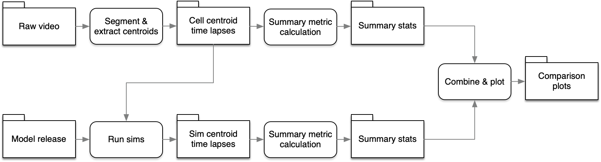

# Workflow Colony Formation

[](https://github.com/AllenCellModeling/workflow_colony_formation/actions)
[](https://codecov.io/gh/AllenCellModeling/workflow_colony_formation)

Model of colony formation informed by timelapse video of replated cells.

---

## Features

- [ ] Load raw image from network storage
- [ ] Segment and track raw file
- [ ] Store segmentations in `exp_tracks`
- [ ] Create set of starting conditions for runs based on first image frame
- [ ] Store starting conditions on disk in `steps/sim_init`
- [ ] Load starting conditions into model and run
- [ ] Store model output in `steps/sim_tracks`
- [ ] ...

## Workflow



## Installation and running

Locally clone and run: 

```
git clone https://github.com/AllenCellModeling/workflow_colony_formation.git
cd workflow_colony_formation
./run.py
```

## Documentation

For full package documentation please visit [AllenCellModeling.github.io/workflow_colony_formation](https://AllenCellModeling.github.io/workflow_colony_formation).

Available under the Allen Institute Software License
