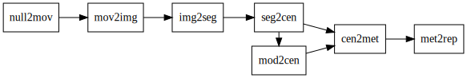

# Workflow Colony Formation

[](https://github.com/AllenCellModeling/workflow_colony_formation/actions)
[](https://codecov.io/gh/AllenCellModeling/workflow_colony_formation)

Model of colony formation informed by timelapse video of replated cells.

---

## Features

- [ ] Load raw image from network storage
- [ ] Segment and track raw file
- [ ] Store segmentations in `exp_tracks`
- [ ] Create set of starting conditions for runs based on first image frame
- [ ] Store starting conditions on disk in `steps/sim_init`
- [ ] Load starting conditions into model and run
- [ ] Store model output in `steps/sim_tracks`
- [ ] ...

## Workflow

The steps and their dependencies or flow is described by the graph:



- [`null2mov`] copies the timelapse data from on-premises storage and uploads it to quilt
- [`mov2img`] writes out readable frames from the complicated mosaic CZI
- [`img2seg`] segments the DNA channel from each frame using [Cellpose](http://cellpose.org)
- [`seg2cen`] takes the centroids of every segmented cell, does some post processing, and saves them as a simplified CSV
- [`mod2cen`] takes the centroid inputs and runs a parameter sweep, outputting simulated centroid locations
- `cen2met` computes summary metrics for the experimental and simulated traces
- `met2rep` produces output images summarizing the computed metrics

[`null2mov`]:https://github.com/AllenCellModeling/workflow_colony_formation/tree/master/workflow_colony_formation/steps/null2mov
[`mov2img`]:https://github.com/AllenCellModeling/workflow_colony_formation/tree/master/workflow_colony_formation/steps/mov2img
[`img2seg`]:https://github.com/AllenCellModeling/workflow_colony_formation/blob/master/workflow_colony_formation/steps/img2seg/img2seg.ipynb
[`seg2cen`]:https://github.com/AllenCellModeling/workflow_colony_formation/blob/master/workflow_colony_formation/steps/seg2cen/seg2cen.ipynb
[`mod2cen`]:https://github.com/AllenCellModeling/workflow_colony_formation/blob/master/workflow_colony_formation/steps/mod2cen/mod2cen.ipynb

## Installation and running

Locally clone and run: 

```
git clone https://github.com/AllenCellModeling/workflow_colony_formation.git
cd workflow_colony_formation
./run.py
```

## Documentation

For full package documentation please visit [AllenCellModeling.github.io/workflow_colony_formation](https://AllenCellModeling.github.io/workflow_colony_formation).

Available under the Allen Institute Software License
